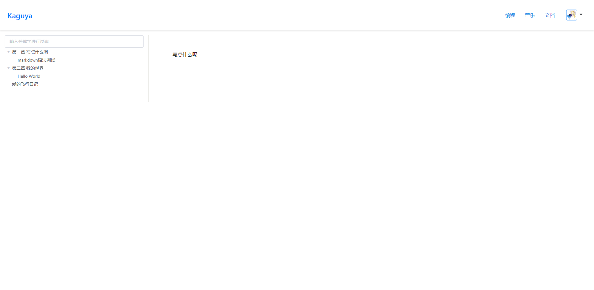

# kaguya

### 特点
* 树型结构文档
* 第三方登录认证
* redis缓存
* 雪花算法

## 未启航的纸飞机

某一天，还是把这个废弃的项目又捡了起来，但是这一次，我并不打算完整的实现它，它只是还未启航的纸飞机。

很久之前，我用SSM框架做了一个支持多用户的博客系统，功能很多，里面所有的前后端都是自己实现。说实话，那段时间写业务逻辑写到吐了，当然最重要的原因是我的技术不行，我也不想写前端。但这一次，还是打算实现当初的一些想法。这个项目的定位是简单、易用。

### 用户的设计
首先是用户的设计，支持账号/密码登录(Local OAuth)，也支持第三方的登录验证(Third-part OAuth)。目的只有一个，采用用户ID+token的方式进行验证。
采用`type:userId:过期时间:token(salt)`的方式存储用户信息到cookie，如需用户信息，将在缓存中获取。当重新访问的时候，从cookie中取出相关信息，
查找用户信息，放一些必须的信息到session中，其他信息从redis中取。
纳尼？用户注册在哪里？用户的初始化采用SQL脚本的形式。如果你不想用本地用户登录，那么可以采用第三方登录验证的形式，目前只支持Github。为什么不支持其他？因为懒。

### 内容的设计
接着，是内容的设计，内容采用**分类+树形文档结构**的形式，这是我一直以来的一个念想。每一个分类像是一本书，或是一次长途探索。而每一个文档则是书的每一篇章节，或是每一段探索的过长。

### 评论的设计
2333，不支持。

### 国际化
2333，不支持

### CRUD
作为一个系统，最起码的增删改查功能你得有嘛。卧槽，还真没有。

因为这是一个小的设想。原本登录管理功能和阅读功能应该分开的，但是我都放到了一起。目前只提供了最基本的功能，角色的登录，新增分类，新增文档，退出系统，
阅读文档。

### 一些插件和技术说明
uuid采用的twitter的SnowFlake，json转换用的是FastJson和GSON。编辑器用的是Editormd，Markdown内容存MySQL，HTML内容存Redis，转换工具用的
是flexmark，第三方登录用的是JustAuth第三方授权登录的工具类库。

### 后续
没有后续了，写一套完整的系统需要很长的时间，需要进行安全控制和性能优化，需要考虑很多东西。我对管理系统的设计并没有太大兴趣，把大体的内容设计好我就已经满足了，就当做我是自言自语，自得其乐吧。

### 预览

 
## 构建
 
### 环境配置

* MySQL 5.7
* Redis 3.2
* Java8

### 第一步
在`application.properties`文件中配置MySQL和Redis, 运行`kaguya.sql`或`kaguya-no-data.sql`;
 
### 第二步
运行`com.github.kaguya.KaguyaApplicationTests.user`初始化用户;
 
### 第三步
访问[localhost:9420](localhost:9420);
 
## License
[BSD 3-Clause](./LICENSE)
